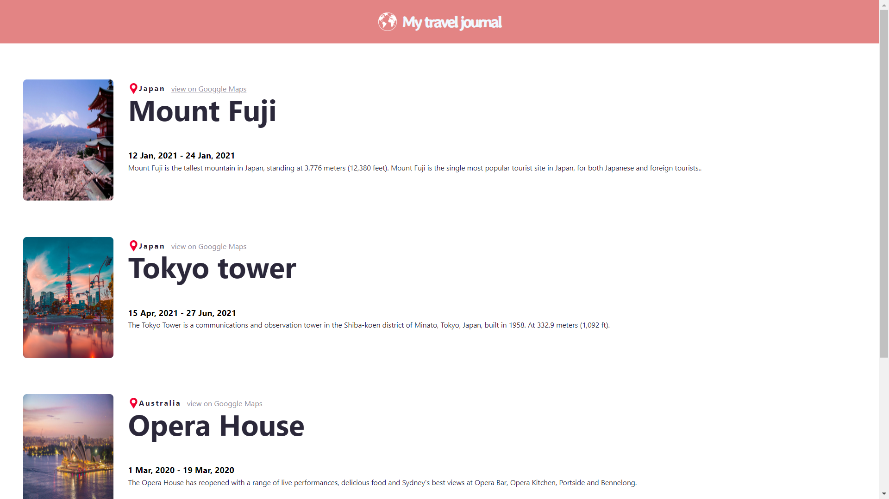
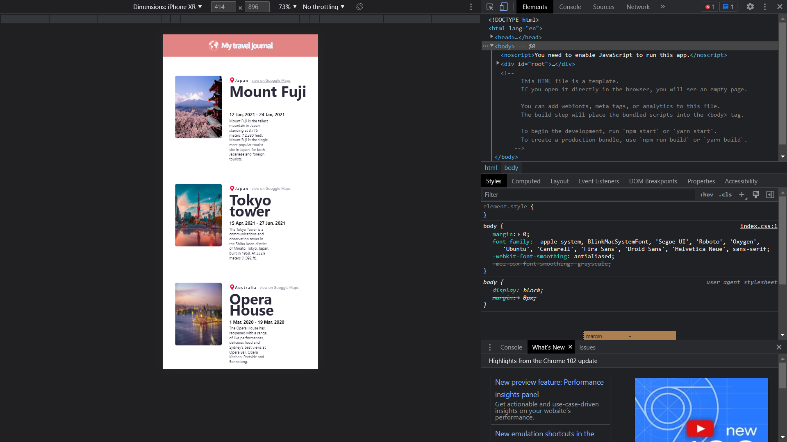

# Travel journal website 
## working image of project `journal website`

## using `React`
 This website was created using **Create-React-App**
 React framework is the most rapidly developing
webframework in existence.
## website details
this website is also an project website from **bob zirolls** course [learn React](https://scrimba.com/learn/learnreact) from `scrimba`. 
i developed this site with React components 
## justified content

the above image shows the rendered website with different resolution of **Iphone XR**
 
the content was made adoptible with every resolution by using `css-3` code snippets.
 
> [`Figma`](https://www.figma.com/?fuid=) website was used to **scale the components** of the website which includes
- colours
- sizes
- font-weights
- overall ratios

## Components used
- `props` in [React](https://www.javatpoint.com/react-props#:~:text=React%20Props,-Props%20stand%20for&text=It%20is%20an%20object%20which,arguments%20passed%20in%20a%20function.)   
 props helps us in passing down data more effieciently and will reduce code by a number of instances. 
 **props** are passed as **parameters in the function** where the parameters are called again as objects inside the function.    
 - `map function` in [React](https://www.pluralsight.com/guides/how-to-use-the-map()-function-to-export-javascript-in-react) 
 map function in React allows us to use multiple data elements with different identities to get mapped onto the data with a single `map function()` 
 - maps has multiple uses while building a large scale websites with multiple info labels having the same styling associated with all of them.

 ## challanges faced
 - adding multiple pictures into the `data.js` file happend to be a troublesome task since mapping all of them was not quite a serene task..
 - still cant able to set the main tittle of the card in the page. the font seems to slightly overlapping with themselves.have to adjust it with `@media screen` css styles.
 - so that even at 